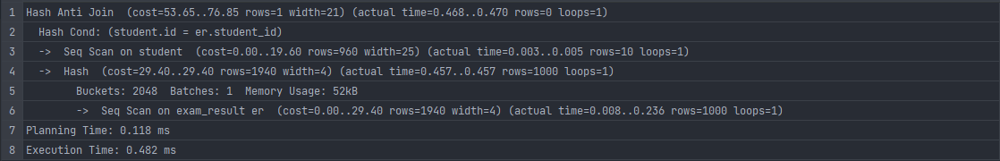
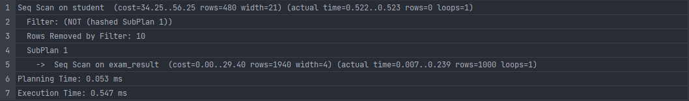
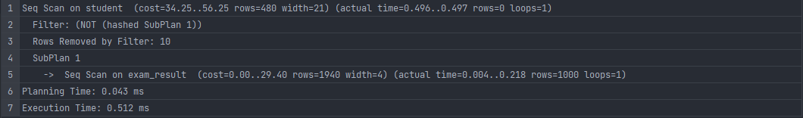
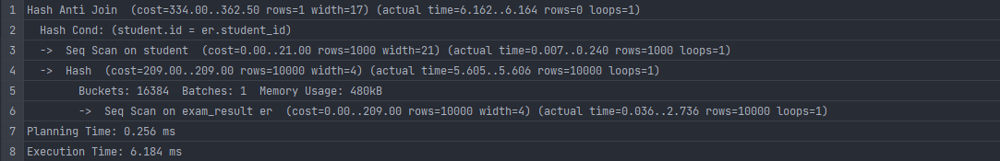
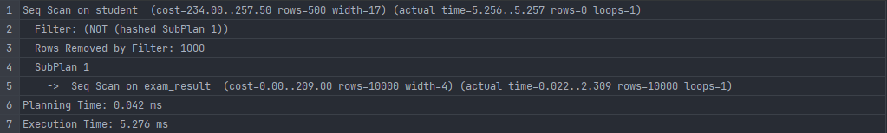
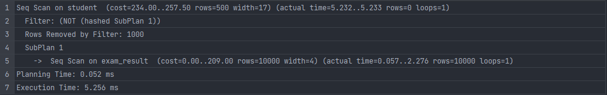
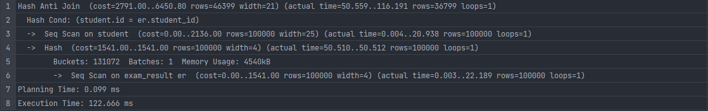
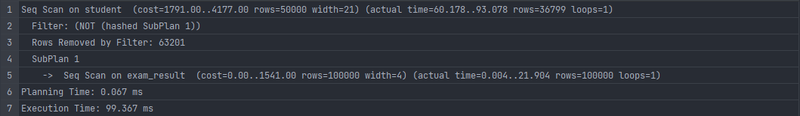
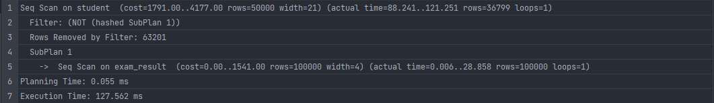

-- Task 9 - Select students who does not pass any exam using each the following operator: – 0.5 points.\
-- Outer join\
-- Subquery with ‘not in’ clause\
-- Subquery with ‘any ‘ clause\
-- Check which approach is faster for 1000, 10K, 100K exams and 10, 1K, 100K students

For 1000 exams and 10 students\
-- Outer join\

-- Subquery with ‘not in’ clause\

-- Subquery with ‘any ‘ clause\

For 10K exams and 1K students\
-- Outer join\

-- Subquery with ‘not in’ clause\

-- Subquery with ‘any ‘ clause\

For 100K exams and 100K students\
-- Outer join\

-- Subquery with ‘not in’ clause\

-- Subquery with ‘any ‘ clause\

